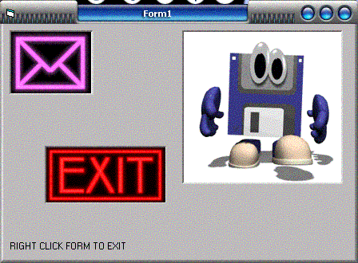



## Animated Gif Buttons

### Description

Use Animated Gif as buttons with just a few lines of code, no ocx or dlls. VERY SIMPLE.
 
### More Info
 

             |
---                |---
**Submitted On**   |2004-08-31 11:00:08
**By**             |[ElitePCBOX](https://github.com/Planet-Source-Code/PSCIndex/blob/master/ByAuthor/elitepcbox.md)
**Level**          |Intermediate
**User Rating**    |3.7 (11 globes from 3 users)
**Compatibility**  |VB 6\.0
**Category**       |[Graphics](https://github.com/Planet-Source-Code/PSCIndex/blob/master/ByCategory/graphics__1-46.md)
**World**          |[Visual Basic](https://github.com/Planet-Source-Code/PSCIndex/blob/master/ByWorld/visual-basic.md)
**Archive File**   |[Animated\_G1787908312004\.zip](https://github.com/Planet-Source-Code/elitepcbox-animated-gif-buttons__1-55919/archive/master.zip)

